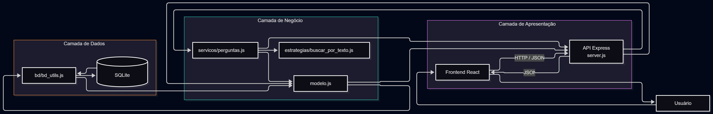

# Análise arquitetural

## Arquitetura atual

O ESM Forum utiliza uma arquitetura cliente-servidor. O frontend em React funciona como cliente e se comunica por HTTP com o backend em Express, que disponibiliza os dados em JSON.

No backend também existe uma separação em camadas, ainda que simples.

### Apresentação

O frontend React é responsável pela interface com o usuário.

No backend, `server.js` recebe as requisições HTTP, acessa os parâmetros enviados e devolve as respostas da API.

### Negócio

`modelo.js` concentra as operações relacionadas a perguntas e respostas.

A funcionalidade de busca também possui uma camada de serviço em `servicos/perguntas.js` e uma estratégia específica em `estrategias/buscar_por_texto.js`.

### Dados

`bd/bd_utils.js` encapsula o acesso ao SQLite por meio da biblioteca `better-sqlite3`.

O banco armazena atualmente perguntas e respostas.

## Comunicação

O frontend utiliza `fetch` para realizar requisições ao backend em `http://localhost:5000`.

O fluxo principal é:

Frontend React → API Express → lógica da aplicação → acesso ao SQLite → resposta JSON → Frontend React.

## Diagrama arquitetural

