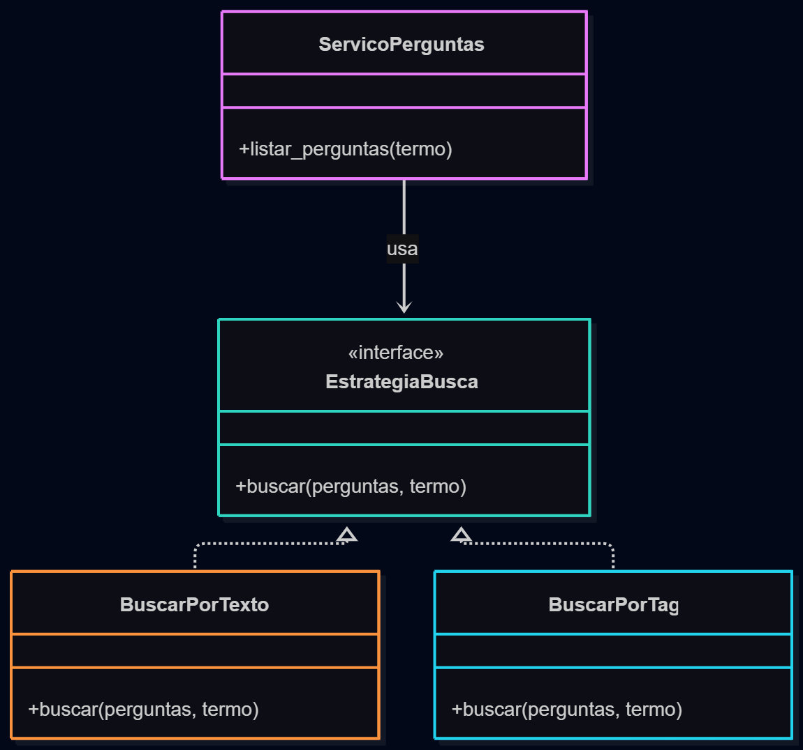
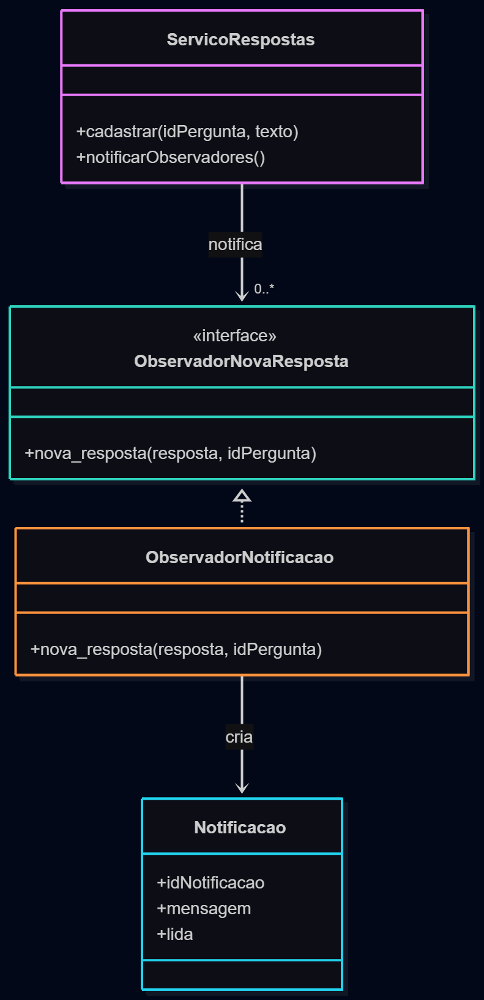
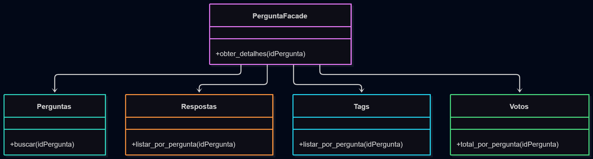

# Proposta de aplicação de padrões de projeto

## Strategy

### Contexto e justificativa

A busca por palavra-chave já utiliza uma estratégia separada para filtrar perguntas pelo texto. Com a inclusão da categorização por tags, a busca pode passar a admitir critérios diferentes sem concentrar todos eles no serviço de perguntas.

O padrão Strategy permite representar cada forma de busca separadamente e trocar o algoritmo utilizado sem alterar o serviço responsável pelo caso de uso.

### Proposta

A estratégia atual `buscar_por_texto` seria mantida e uma nova estratégia `buscar_por_tag` poderia ser adicionada.

O serviço receberia a estratégia de busca como dependência:

```javascript
function criar_servico_perguntas(modelo, estrategia_busca) {
  return {
    listar_perguntas(busca) {
      const perguntas = modelo.listar_perguntas();
      const termo = typeof busca === 'string' ? busca.trim() : '';

      return termo ? estrategia_busca(perguntas, termo) : perguntas;
    }
  };
}
```

Uma estratégia de busca por tag poderia ser:

```javascript
function buscar_por_tag(perguntas, tag) {
  return perguntas.filter(pergunta =>
    pergunta.tags.some(item =>
      item.nome.toLowerCase() === tag.toLowerCase()
    )
  );
}
```

Com isso, novas formas de pesquisa podem ser adicionadas sem alterar o serviço.



## Observer

### Contexto e justificativa

Na funcionalidade de notificações, o autor de uma pergunta deve ser informado quando uma nova resposta for cadastrada.

Essa situação representa uma relação natural entre um evento e uma reação: o cadastro da resposta ocorre normalmente e, após o evento, os interessados são avisados.

O padrão Observer permite separar a criação da resposta da lógica responsável pelas notificações.

### Proposta

Um serviço de respostas atuaria como publicador do evento de nova resposta. Observadores poderiam se inscrever nesse evento.

O `ObservadorNotificacao` receberia a informação da nova resposta e criaria uma notificação para o autor da pergunta.

```javascript
function criar_servico_respostas(modelo, observadores) {
  return {
    cadastrar(id_pergunta, texto) {
      const resposta = modelo.cadastrar_resposta(id_pergunta, texto);

      observadores.forEach(observador =>
        observador.nova_resposta(resposta, id_pergunta)
      );

      return resposta;
    }
  };
}
```

Um observador responsável pelas notificações poderia ser definido assim:

```javascript
const observador_notificacao = {
  nova_resposta(resposta, id_pergunta) {
    notificacoes.criar_para_autor(id_pergunta, resposta);
  }
};
```

Dessa forma, o cadastro da resposta não precisa conhecer os detalhes de criação e armazenamento das notificações.



## Facade

### Contexto e justificativa

Com a evolução do fórum, a visualização de uma pergunta pode precisar reunir informações de diferentes partes do sistema: a própria pergunta, suas respostas, tags e quantidade de votos.

Sem uma camada de coordenação, a rota teria de consultar separadamente cada módulo necessário.

O padrão Facade pode oferecer uma única operação para obter os dados completos de uma pergunta, escondendo essa coordenação da camada HTTP.

### Proposta

Um módulo `PerguntaFacade` faria a composição dos dados necessários utilizando os módulos responsáveis por cada informação.

```javascript
function criar_pergunta_facade(perguntas, respostas, tags, votos) {
  return {
    obter_detalhes(id_pergunta) {
      return {
        pergunta: perguntas.buscar(id_pergunta),
        respostas: respostas.listar_por_pergunta(id_pergunta),
        tags: tags.listar_por_pergunta(id_pergunta),
        votos: votos.total_por_pergunta(id_pergunta)
      };
    }
  };
}
```

A rota utilizaria apenas a fachada:

```javascript
app.get('/perguntas/:id', (req, res) => {
  const dados = pergunta_facade.obter_detalhes(req.params.id);
  res.json(dados);
});
```

Isso reduz a quantidade de detalhes que a camada HTTP precisa conhecer e mantém a coordenação dessas informações em um único ponto.


