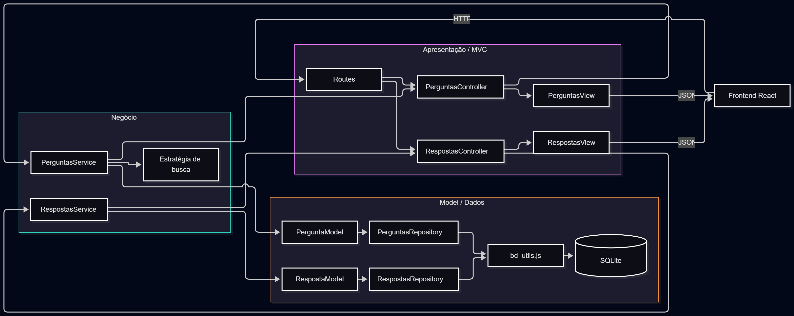

# Proposta de organização arquitetural

## Separação em camadas

A evolução do ESM Forum pode manter três camadas principais: apresentação, negócio e dados.

### Apresentação

A camada de apresentação recebe as requisições HTTP e devolve as respostas da API.

Ela conteria as rotas e controllers, sem executar consultas SQL ou regras de negócio.

Exemplos:

- `routes/perguntas.js`
- `routes/respostas.js`
- `controllers/perguntas_controller.js`
- `controllers/respostas_controller.js`

As rotas identificariam a operação solicitada e encaminhariam os dados ao controller correspondente.

### Negócio

A camada de negócio concentraria os casos de uso e regras da aplicação.

Exemplos:

- `services/perguntas_service.js`
- `services/respostas_service.js`
- `estrategias/buscar_por_texto.js`

O serviço de perguntas poderia listar e buscar perguntas. O serviço de respostas seria responsável pelo cadastro de respostas e poderia acionar a criação de notificações.

Essa camada utilizaria a camada de dados por meio das dependências recebidas pelos serviços.

### Dados

A camada de dados seria responsável pela persistência no SQLite.

Exemplos:

- `models/pergunta_model.js`
- `models/resposta_model.js`
- `repositories/perguntas_repository.js`
- `repositories/respostas_repository.js`
- `bd/bd_utils.js`

Os repositories concentrariam as consultas SQL, enquanto `bd_utils.js` continuaria responsável pela comunicação com o SQLite.

O fluxo entre as camadas seria:

`rota → controller → service → repository → banco`

A resposta retornaria pelo caminho inverso até ser enviada ao cliente.

## Aplicação de MVC

No backend, o MVC poderia ser aplicado às funcionalidades de perguntas e respostas.

### Perguntas

O Model representaria as operações relacionadas às perguntas, como cadastrar, listar e buscar.

O Controller receberia a requisição, chamaria o serviço necessário e selecionaria a resposta adequada.

A View seria a representação JSON devolvida pela API.

Exemplo:

```javascript
async function listar(req, res) {
  const perguntas = perguntas_service.listar(req.query.busca);
  res.json(perguntas_view.lista(perguntas));
}
```

### Respostas

O Model representaria operações como cadastrar e listar respostas de uma pergunta.

O Controller receberia o identificador da pergunta e os dados enviados pelo usuário, delegando a operação ao serviço.

A View formataria o resultado em JSON.

Exemplo:

```javascript
async function cadastrar(req, res) {
  const resposta = respostas_service.cadastrar(
    req.body.id_pergunta,
    req.body.resposta
  );

  res.json(respostas_view.detalhe(resposta));
}
```

## Fluxo completo

Em uma busca por perguntas:

1. o frontend envia `GET /perguntas?busca=termo`;
2. a rota encaminha a requisição ao `PerguntasController`;
3. o controller chama o `PerguntasService`;
4. o serviço utiliza o repository e a estratégia de busca;
5. os dados retornam ao controller;
6. a View formata a lista;
7. o backend responde ao frontend em JSON.

Em um cadastro de resposta:

1. o frontend envia `POST /respostas`;
2. a rota encaminha a requisição ao `RespostasController`;
3. o controller chama o `RespostasService`;
4. o serviço aplica as regras necessárias e utiliza o `RespostaModel`;
5. o model acessa o repository para persistir a resposta;
6. o resultado retorna ao controller;
7. a `RespostasView` formata a resposta em JSON;
8. o backend devolve o resultado ao frontend.

## Diagrama


